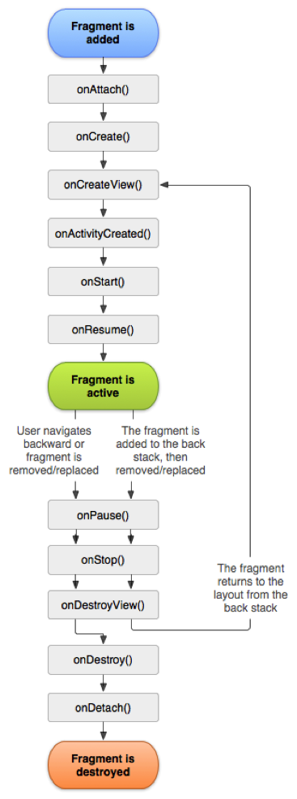
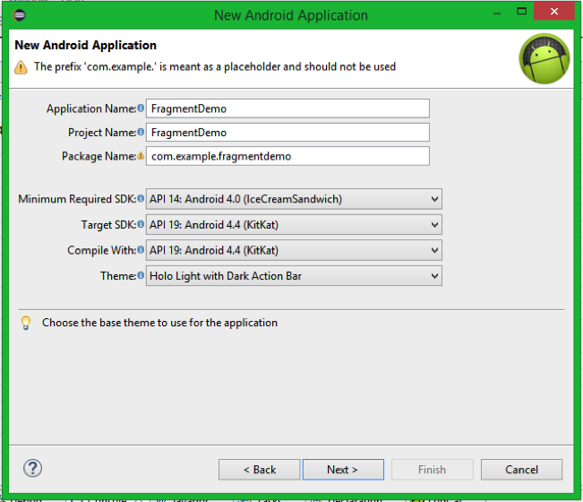
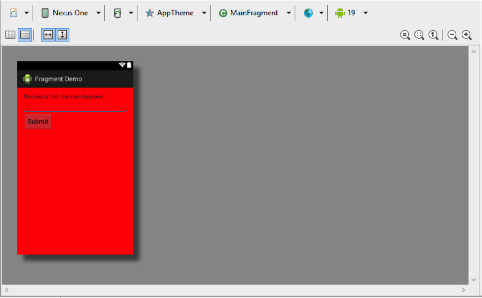
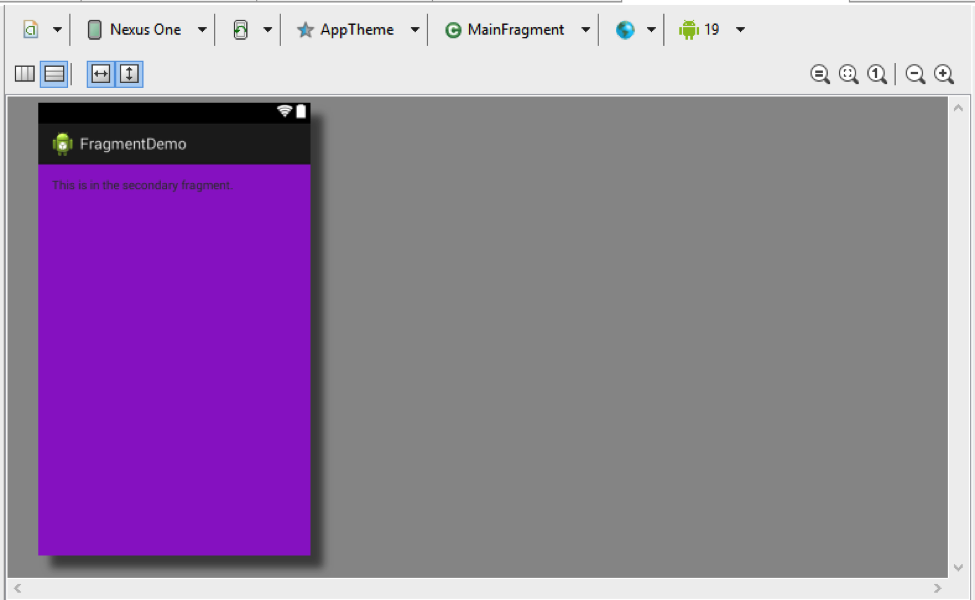
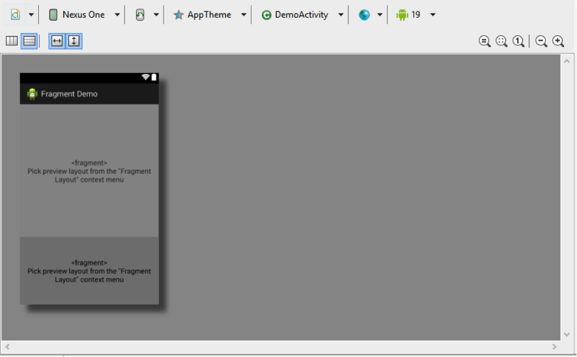
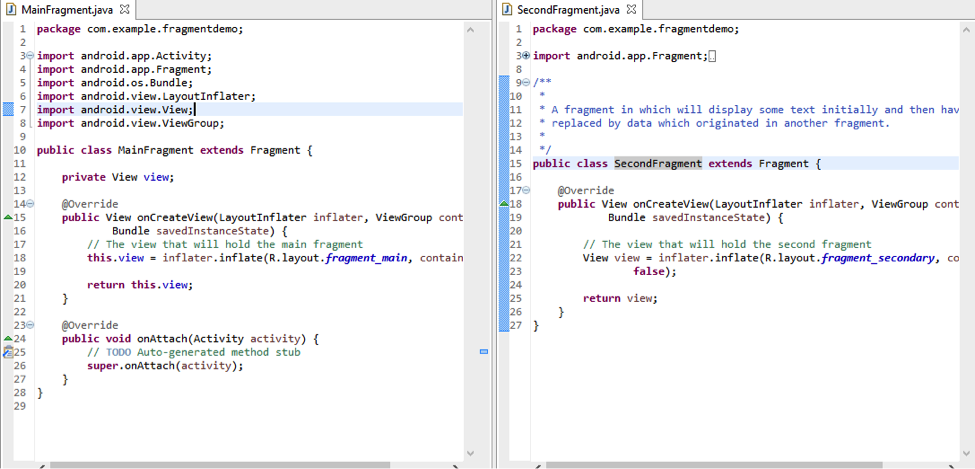
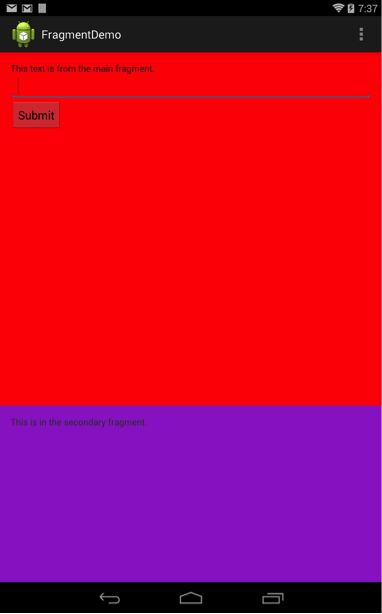
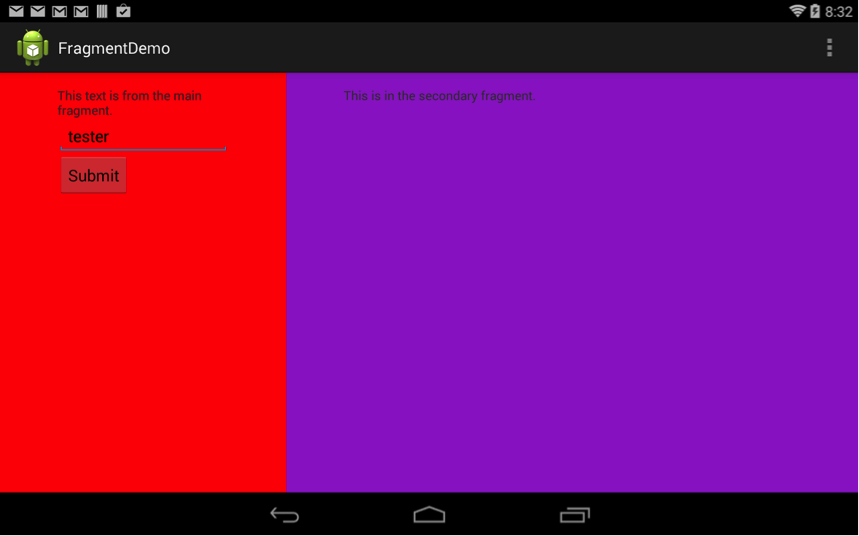

# Recreating from Scratch

## *What are Fragments?*

Fragments are pieces of an application's user interface or behavior that can be 
placed in an activity which enables a more modular and responsive design.

### The benefits of using fragments

- You can add or remove fragments in an activity during runtime.
- You can combine multiple fragments in a single activity to build a UI 
  with multiple panes.
- A fragment has its own layout and its own behavior.
- A fragment can be used in multiple activities.

### The relationship of fragments to an activity and other fragments

In order to reuse the Fragment UI components, you should build each as a 
completely self-contained, modular component that defines its own layout and 
behavior. Once you have defined these reusable Fragments, you can associate them 
with an Activity and connect them with the application logic to realize the 
overall composite UI.

## Fragment Lifecycle

The fragment life cycle is closely related to the lifecycle of its host activity 
which means when the activity is paused, all the fragments available in the 
activity will also be stopped.

### *Phase I:*

When a fragment gets created, it goes through the following states:

- onAttach()
- onCreate()
- onCreateView()
- onActivityCreated()

### *Phase II:*

When the fragment becomes visible, it goes through these states:
- onStart()
- onResume()

### *Phase III:*

When the fragment goes into the background mode, it goes through these states:

- onPaused()
- onStop()

### *Phase IV:* 

When the fragment is destroyed, it goes through the following states:
- onPaused()
- onStop()
- onDestroyView()
- onDestroy()
- onDetach()

#### *The image below is a visual representation of this lifecycle:*




## Fragment classes of note

### *Fragment*

- A Fragment is a piece of an application's user interface or behavior that can 
  be placed in an Activity.

### *FragmentManager*

- Interface for interacting with Fragment objects inside of an Activity


### *FragmentTransaction*

- API for performing a set of Fragment operations.


## Create a new Application

1. Open the eclipse IDE with the Android plugin.

2. Create a new Android Application project and name it "FragmentDemo".

3. Adjust the settings to match the image below.
   

4. Keep the the default settings and continue to Click Next the finish button is 
   enabled then Click Finish.


## Adding Layouts

Before we jump into the code, we need to have an idea of what we would like the 
fragments to do and where they should go. In this tutorial we will focus on placing 
two fragments inside the main activity. We will then have one fragment send data to 
the second fragment.

1. Add the following strings to `res/values/strings.xml`

   ```xml
   <string name="mainfrag">This text is from the main fragment.</string>
   <string name="secondfrag">This is in the secondary fragment.</string>
   <string name="submit">Submit</string>
   ```

2. Create the following file in the res/values/colors.xml and add the following 
   content.

   ```xml
   <?xml version="1.0" encoding="utf-8"?>
   <resources>
     <color name="red">#ffff0000</color>
     <color name="darkpurple">#FF9933CC</color>
   </resources>
   ```

3. Create the following layout XML files in the res/layout.

  - `fragment_main.xml`
  
    

 - `fragment_secondary.xml`

    

  - `activity_main.xml`

    

*Note: If you do not see the result as shown above, be sure you are using the 
correct package name and the API version is set to 19. As seen above to the top 
right beside the android logo*

## Using the Fragments

Now that we have our layouts set up we can use them in our code.

1. Right click on the project and create a new class named `MainFragment` and set
   the superclass to `android.app.Fragment`

2. Repeat the previous step and create the class `SecondFragment`

3. Go back to the MainFragment class and override the following methods: 
   *(Right Click → Source → Override/Implement Method)*
  - onAttach()
  - onCreateView()

4. In MainFragment add the following instance variables:
  - `private View view`
  - `private EditText entryField`

5. In `onCreateView()` set the newly created variable `view` to use the layout you 
   created earlier for this fragment:

   ```java
   view = inflater.inflate(R.layout.fragment_main, container, false);
   ```

6. Go to the SecondFragment class and override `onCreateView()`

7. Inflate the `fragment_secondary` layout like in the previous fragment.

   

8. Rename your `MainActivity` class to `DemoActivity` 
   *(Right click on the class → Refactor → Rename, Change the name and 
    Click Finish)* 

Run the project on your Android device or emulator and you should have something 
that looks like this.




## Transferring Data between Fragment

At this point our application is pretty boring. To make things a little more 
interesting lets have the main fragment change the TextView in the second fragment.

### Setting up Communication

1. Add an interface that contains an abstract method that will take the text that 
   is passed to it from this fragment and do something with it in the parent 
   activity. This can be done by adding the following code to the `MainFragment`
   class:

   ```java
   public interface OnSubmitListener {
     public void onSubmission(String text);
   }
   ```
   
2. Create an instance variable for this listener:
   ```java
   private OnSubmitListener listener;
   ```

3. In the `onAttach` method you overrode earlier add the following code after the 
   call to `super.onAttach(activity)`

   ```java
   /*
    * Check that the activity adding this fragment has implemented the
    * OnSubmitListener interface. If it has not then an exception is thrown
    * with a message stating that it must be implemented.
    */
   if (activity instanceof OnSubmitListener) {
     listener = (OnSubmitListener) activity;
   } else {
     throw new ClassCastException(activity.toString()
	   + " must implemenet MainFragment.OnSubmitListener");
   }
   ```
   
4. Navigate to `DemoActivity` and implement the`onSubmision` method. This method 
   takes a string of text that is entered into an EditText from the first fragment 
   and replaces the text of the TextView in the second fragment with it.

   ```java
   public void onSubmission(String text) {

     SecondFragment fragment = (SecondFragment) getFragmentManager()
       .findFragmentById(R.id.fragmentSecond);

     if (fragment != null && fragment.isInLayout()) {

       TextView tv1 = (TextView) findViewById(R.id.TextView1);

       tv1.setText(text); // TODO: make update persist rotation

     } // end if

   } // end onSubmission(String text)
   ```

5. While still in `DemoActivity` implement OnSubmitListener by updating the 
   class's signature to the like so:

   ```java
   public class DemoActivity extends Activity implements OnSubmitListener
   ```

### Sending Data

1. Back in `MainFagment`, create an instance variable for the text:

   ```java
   private EditText entryField;
   ```

2. In `onCreateView` initialize it and create a listener to the button:

   ```java
   this.entryField = (EditText) view.findViewById(R.id.editTextEntryField);
   Button submit = (Button) view.findViewById(R.id.buttonSubmit);
   ```

3. Next you need to setup the listener to send the EditText's data on submit. 
   This is done by passing it through the interface we created in the last 
   section in the onCreateView method.

   ```java
   // Add a listener to the submit button
	submit.setOnClickListener(new View.OnClickListener() {

	  @Override
	  public void onClick(View v) {

		// The text that was entered
		String enteredText = entryField.getText().toString();

		/*
		 * Pass the entered text through this fragment's interface to
		 * the onSubmission method that is implemented in the parent
		 * activity.
		 */
		listener.onSubmission(enteredText);
	  }
	});
   ```

At this point you should be able to run the application and use the EditText on 
the main fragment to modify the TextView in the second Fragment.

## Reusing Fragments

In order to illustrate how flexible fragments are will will change the appearance 
the fragments in landscape.

1. Create the folder `res/layout-land`
2. Create a landscape layout in the newly created folder and name it 
   `activity_main.xml`
3. And the following code to the layout:

   ```xml
   <LinearLayout xmlns:android="http://schemas.android.com/apk/res/android"
    xmlns:tools="http://schemas.android.com/tools"
    android:id="@+id/container"
    android:layout_width="match_parent"
    android:layout_height="match_parent"
    android:baselineAligned="false"
    android:orientation="horizontal"
    tools:context="com.example.fragmentdemo.DemoActivity"
    tools:ignore="MergeRootFrame" >

    <!--
    Add both fragments and but, in contrast to the portrate 
    view, make the first one twice as big as the second one.
    
    Note that the only thing needed to make this change was 
    one layout file with two refernces to fragmetns in it... 
    no reimplementing of code was needed nor was there a need 
    to add the fragments' layout files to the layout-land folder.
    -->

    <fragment
        android:id="@+id/fragmentMain"
        android:name="com.example.fragmentdemo.MainFragment"
        android:layout_width="match_parent"
        android:layout_height="match_parent"
        android:layout_weight="2" />

    <fragment
        android:id="@+id/fragmentSecond"
        android:name="com.example.fragmentdemo.SecondFragment"
        android:layout_width="match_parent"
        android:layout_height="match_parent"
        android:layout_weight="1" />

   </LinearLayout>
   ```

Compile and run the application. If all is well you should have something that 
looks like this:



If you would like more information on fragments then check out 
http://developer.android.com/guide/components/fragments.html
